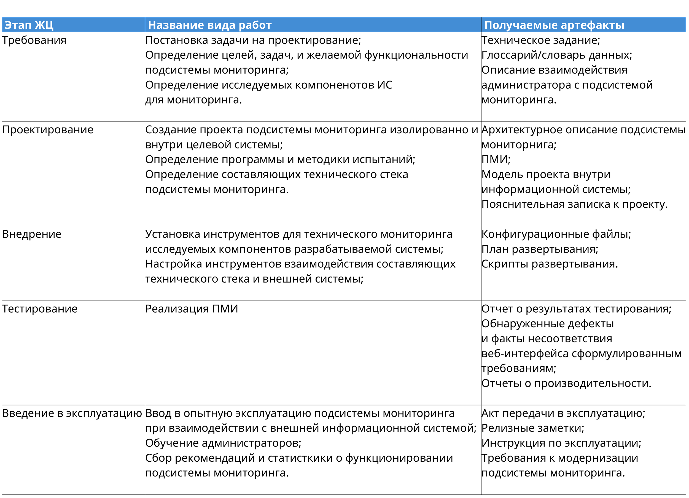

# SystemLifecycle
Рисую диаграммы и таблицы в качестве DevOps практики

## Информационная система LMS

### Компонент "База данных"

```plantuml
!include <C4/C4_Container>

left to right direction 


System_Boundary(life, "База данных") {
    Container(requirements, "Требования", "Определение основных требований к базе данных")
    Container(project, "Проектирование", "Создание проекта базы данных")
    Container(realisation, "Реализация", "Создание рабочей версии целевой БД")
    Container(testing, "Тестирование", "Тестирование БД на соответствие постановке задачи")
    Container(use, "Введение в эксплуатацию", "Внедрение, эксплуатацияя и сопровождение БД")
}
Container(done, "Вывод из эксплуатации")

Rel(requirements, project, "Сбор и анализ требований")
Rel(project, realisation, "Выбор целевой системы управления базами данных")
Rel(realisation, testing, "Конвертирование и загрузка данных")
Rel(testing, requirements, "Валидация")
Rel(testing, use, "Пробный запуск БД")
Rel(life, done, "")

```

```plantuml
skinparam titleFontSize 60
skinparam titleFontStyle plain

title

    |=<#438dd5><color: White> Этап ЖЦ |=<#438dd5><color: White> Название вида работ |=<#438dd5><color: White> Получаемые артефакты |
    |Требования |Постановка задачи на проектирование; \nопределение цели, задач\nи желательной функциональности БД |Техническое задание на разработку\nбазы данных;\nГлоссарий/словарь данных;\nОписание взаимодействия пользователя с БД.\n|
    |Проектирование |Создание проекта базы данных; \nвыбор определенной СУБД.|Модель сценариев взаимодействия БД с её\nокружением;\nАрхитектурное описание;\nПМИ;\nПояснительная записка;\nЛогический дизайн БД;\nКонструкторская и проектная документация.\n|
    |Реализация |Реализация базы данных с использованием\nвыбранной СУБД;\nЗагрузка данных для последующего тестирования.\n|Исходный код БД в среде СУБД. |
    |Тестирование |Реализация ПМИ |Отчет о результатах тестирования;\nОбнаруженные дефекты,\nфакты несоответствия БД предъявленным\nтребованиям;\nОтчеты о производительности;\nЖурналы log'ов.\n|
    |Введение в эксплуатацию |Загрузка данных; \nВнедрение БД в информационную систему; \nОбучение пользователей; \nПоследующее сопровождение БД\n|Акт передачи в эксплуатацию;\nДокументация по установке и настройке,\nинструкция по эксплуатации для\nадминистраторов.|
end title

```

### Разрабатываемый програмный модуль "Веб-интерфейс"

```plantuml
!include <C4/C4_Container>
skinparam titleFontSize 60

left to right direction 

System_Boundary(life, "Веб-интерфейс") {

    Container(requirements, "Требования", "Определение основных требований к веб-интерфейсу")
    Container(project, "Проектирование", "Создание проекта веб-интерфейса внутри целевой системы")
    Container(realisation, "Реализация", "Непосредственная разработка")
    Container(integration, "Внедрение", "Настройка инструментов взаимодействия с целевой системой")
    Container(acceptance_testing, "Тестирование", "Произведение Тестирования веб-интерфейса при взаимодействии с целевой системой")
    Container(use, "Введение в эксплуатацию", "Эксплуатацияя и сопровождение веб-интерфейса")
}
Container(done, "Вывод из эксплуатации")

Rel(requirements, project, "Сбор и анализ требований")
Rel(project, realisation, "Разработка проекта")
Rel(realisation, integration, "API, загрузка статического содержимого")
Rel(integration, acceptance_testing, "Произвидение Unit, Integration и System тестирования")
Rel(acceptance_testing, requirements, "Валидация")
Rel(acceptance_testing, use, "Пробный запуск")
Rel(life, done, "")


```
```plantuml

skinparam titleFontSize 60
skinparam titleFontStyle plain

title
    |=<#438dd5><color: White> Этап ЖЦ |=<#438dd5><color: White> Название вида работ |=<#438dd5><color: White> Получаемые артефакты |
    |Требования |Постановка задачи на проектирование;\nОпределение целей, задач, и желаемой\nфункциональности веб-интерфейса.\n|Техническое задание;\nГлоссарий/словарь данных;\nОписание взаимодействия\nпользователя с\nвеб-интерфейсом.\n|
    |Проектирование |Создание проекта веб-интерфейса информационной\nсистемы;\nОпределение программы и методики испытаний;\nОпределение инструментов реализации |ПМИ;\nАрхитектурное описание;\nПояснительная записка к проекту;\nМодель проекта;\nФункциональные схемы;\nГрафический дизайн-макет.\n|
    |Реализация |Непосредственная реализация веб-интерфейса\nна языках программирования;\nКомпиляция объектного кода;\nЗагрузка статического содержимого;\nВерстка интерфейса.\n |Исходный код реализации\nвеб-интерфейса;\n |
    |Внедрение |Настройка инструментов взаимодействия с целевой системой; \nУпаковка в исполняемый формат ОС;\n |Конфигурационные файлы;\nПлан развертывания;\nСкрипты развертывания.\n |
    |Тестирование |Реализация ПМИ |Отчет о результатах тестирования;\nОбнаруженные дефекты\nи факты несоответствия\nвеб-интерфейса сформулированным \nтребованиям;\nОтчеты о производительности;\nЖурналы log'ов.\n|
    |Введение в эксплуатацию |Ввод разработанного веб-интерфейса в опытную эксплуатацию; \nСбор статистики о функциональности веб-интерфейса;\nОбучение пользователей;\nПоследующее сопровождение веб-интерфейса. |Акт передачи в эксплуатацию;\nРелизные заметки;\nИнструкция по эксплуатации.\n|
end title

```

### Компонент "Набор кластерных ресурсов"
```plantuml
!include <C4/C4_Container>

left to right direction 

System_Boundary(life, "Кластеры виртуализации") {

System_Boundary(t, "Анализ требований") {
 Container(requirements, "Определение требований","необходимой производительности, масштабируемости, уровня безопасности")
}

 
    System_Boundary(c1, "Проектирование") {
    Container(arch, "Архитекутура","Определение архитектуры класстеров")
    Container(net, "Сеть","Построение модели сетевого взаимодействия")
}

System_Boundary(c2, "Реализация") {
    Container(vm, "Виртуальные машины","Выделение ресурсов")
    Container(infra, "Инфрастраструктура","Настройка инфраструктуры, сетевого окружения")
}

System_Boundary(c3, "Внедрение") {
    Container(test, "Тестирование")
    Container(intg, "API", "Интеграция с внешними системаи")
}


System_Boundary(c4, "Сопровождение и эксплуатация") {
  Container(monit, "Мониторинг")
  Container(log, "Логирование")
}

}
Container(done, "Вывод из эксплуатации")

Rel(t, c1, "")

Rel(c1, c2, "Построение кластера")

Rel(c2, c3, "Выбор подходящей конфигурации")

Rel(c3, c4, "Вирутализация")

Rel(c4, t, "")


Rel(life, done, "")


```

### Компонент "Подсистема мониторинга"

```plantuml
!include <C4/C4_Container>

left to right direction 

System_Boundary(life, "Подсистема мониторинга") {

    Container(requirements, "Требования", "Определение основных требований к подсистеме мониторинга")
    Container(project, "Проектирование", "Создание проекта подсистемы мониторинга и ее составляющих внутри целевой системы")
    Container(integration, "Внедрение", "Настройка инструментов взаимодействия составлющих подсистемы мониторинга с целевой системой")
    Container(acceptance_testing, "Тестирование", "Произведение тестирования подсистемы мониторинга при взаимодействии с целевой системой")
    Container(use, "Введение в эксплуатацию", "Эксплуатацияя и сопровождение подсистемы мониторинга")

}
Container(done, "Вывод из эксплуатации")

Rel(requirements, project, "Сбор и анализ требований, в т.ч. определение исследуемых компонентов ИС для мониторинга")
Rel(project, integration, "Определение и установка составляющих технического стека подсистемы мониторинга (Graphana, Prometheus...)")
Rel(integration, acceptance_testing, "Подключение источника данных, произвидение Unit, Integration и System тестирования")
Rel(acceptance_testing, requirements, "Валидация")
Rel(acceptance_testing, use, "Пробный запуск")
Rel(life, done, "")

```


[![](https://img.plantuml.biz/plantuml/dsvg/bLPBJnDH5DxtLzp4hQ_4HumYOUKVSE66JIDDR2o5G5reMBHJAXeGY2Q66EIXYJkJSUZOQUcqV-7UV-JtdNkddROp5KWWmxtdyPrpldFENTgi5JTgRrOhXStNvUfwSQEugchbMgNqRArQUrv-Lr8FxsPUrTvMIcgzKYnN2mKvBHGKVhQUBjouV-_Hoig3nOMNQvMrZSVgnQjohRIez6_ZQLyFbVwgVysJ-mwfZWxmDzQH3XK-8ztMlZ9rdFtH0-FDKp_L0trfccO7mg7kcrsQy4qTtaEpZSEUySoksh9mzGzO3MaryMWES0eZfY5uOxdfmJr0-SG1ov72EKw6K1v07IQXM1yRqU6JvQe-4O4GIg6-nA-Dnxnt_tPlfcpY6rR_ofK0Xx6kCjkc2RKUT28Sm2bYsoCeWHSfU1dYecqQ0C0Z2Lc9EeFn85c7Rgmlj9-FIPGRSj26Hp5YMWfn3s1gACP2SUinIAMFz3cCjO7c8CVPRUGM6M_9pGw-6c8j7CKypjCNE1u805_qktS4YsGJXTjJJZmcA1S44QSfGgEH865aNSb5m6f2dExwWajoH1uvh21LGyrcK78FnUp0bgi9UKxpwu_RS_pV6KSwIHS_msrkuL0VM0Al9xoW7CfI841gcX9ODAPNO1aqONyE0oou2scoliKI4Kue9Mz3gCS3fds8EdWkhEuSeZT6NHIGA6RVV8H-IqahJXFZ0j4ueEYsQ_4QL3i4JrfoBkb5DkhIkWXiC4sM3CCpjQQewvXJVQoF-77io7L9HaxLCbK1I08NHWtjz46rf7VZd89ms1pWE7RuROVxx2oosgAN2TIRy6kQAIf-bWvjInaI0lwSdM549Ys0BkzJD6besygvbSbEF4Ezqk1mNeHS7JV7VSvXeV9esisa1hl0TIpk_nF1d1cGIyNbwXMuA8qGC13pGSB9G8fiVsEmA3k88_HB5LwMa2oVBhoxedFEnoubC1zoHRc4o1gYr3dgp6mFPMVbowQ8mA7Ro9n7Pq3hSuOmKGH7XWcxSNa2Wqo0fnWxMTH1Wa559ar-NT_EsBP8Jr3HMCPrKxPO4ZLBWSWjOTbdaKfjOKagQYEBXN5v4uCxu6g-9INt9EXjMrUPsqc74URaN8JZlc9fPtUxxWlO95X262HD5KbkPTQb-j1jsebM2zoiIxQFCfyG40OZNnukNSpllfE6JKfn5CdevApOprUwnkZZd9Indqz_PhmnJU0hZoWUkFhAeseKTFvIHRejT_bMgriosNb0vRPpHmosoNnX5BzwoPOPpBvy9laSNMz1e7Zwa9nZRaEtgznBBhzwZE9CLXgfuVZSaVqOMhIKE4eDf5xILaE6a6dMAcKzEpdUNVNS1keaAjUB5e_RKdN5FjOBI_Za-_uV)](https://editor.plantuml.com/uml/bLPBJnDH5DxtLzp4hQ_4HumYOUKVSE66JIDDR2o5G5reMBHJAXeGY2Q66EIXYJkJSUZOQUcqV-7UV-JtdNkddROp5KWWmxtdyPrpldFENTgi5JTgRrOhXStNvUfwSQEugchbMgNqRArQUrv-Lr8FxsPUrTvMIcgzKYnN2mKvBHGKVhQUBjouV-_Hoig3nOMNQvMrZSVgnQjohRIez6_ZQLyFbVwgVysJ-mwfZWxmDzQH3XK-8ztMlZ9rdFtH0-FDKp_L0trfccO7mg7kcrsQy4qTtaEpZSEUySoksh9mzGzO3MaryMWES0eZfY5uOxdfmJr0-SG1ov72EKw6K1v07IQXM1yRqU6JvQe-4O4GIg6-nA-Dnxnt_tPlfcpY6rR_ofK0Xx6kCjkc2RKUT28Sm2bYsoCeWHSfU1dYecqQ0C0Z2Lc9EeFn85c7Rgmlj9-FIPGRSj26Hp5YMWfn3s1gACP2SUinIAMFz3cCjO7c8CVPRUGM6M_9pGw-6c8j7CKypjCNE1u805_qktS4YsGJXTjJJZmcA1S44QSfGgEH865aNSb5m6f2dExwWajoH1uvh21LGyrcK78FnUp0bgi9UKxpwu_RS_pV6KSwIHS_msrkuL0VM0Al9xoW7CfI841gcX9ODAPNO1aqONyE0oou2scoliKI4Kue9Mz3gCS3fds8EdWkhEuSeZT6NHIGA6RVV8H-IqahJXFZ0j4ueEYsQ_4QL3i4JrfoBkb5DkhIkWXiC4sM3CCpjQQewvXJVQoF-77io7L9HaxLCbK1I08NHWtjz46rf7VZd89ms1pWE7RuROVxx2oosgAN2TIRy6kQAIf-bWvjInaI0lwSdM549Ys0BkzJD6besygvbSbEF4Ezqk1mNeHS7JV7VSvXeV9esisa1hl0TIpk_nF1d1cGIyNbwXMuA8qGC13pGSB9G8fiVsEmA3k88_HB5LwMa2oVBhoxedFEnoubC1zoHRc4o1gYr3dgp6mFPMVbowQ8mA7Ro9n7Pq3hSuOmKGH7XWcxSNa2Wqo0fnWxMTH1Wa559ar-NT_EsBP8Jr3HMCPrKxPO4ZLBWSWjOTbdaKfjOKagQYEBXN5v4uCxu6g-9INt9EXjMrUPsqc74URaN8JZlc9fPtUxxWlO95X262HD5KbkPTQb-j1jsebM2zoiIxQFCfyG40OZNnukNSpllfE6JKfn5CdevApOprUwnkZZd9Indqz_PhmnJU0hZoWUkFhAeseKTFvIHRejT_bMgriosNb0vRPpHmosoNnX5BzwoPOPpBvy9laSNMz1e7Zwa9nZRaEtgznBBhzwZE9CLXgfuVZSaVqOMhIKE4eDf5xILaE6a6dMAcKzEpdUNVNS1keaAjUB5e_RKdN5FjOBI_Za-_uV)

### Компонент API

```plantuml
!include <C4/C4_Container>

left to right direction 

System_Boundary(life, "API") {

    Container(requirements, "Требования", "Определение цели, задач, требований тестирования и желаемой функциональности API")
    Container(project, "Проектирование", "Создание проекта API внутри целевой системы, визуализация связей API с компонентами целевой системы")
    Container(realisation, "Реализация", "Непосредственная разработка")
    Container(integration, "Внедрение", "Настройка инструментов взаимодействия с целевой системой")
    Container(acceptance_testing, "Тестирование API в среде исполнения", "Произведение тестирования API при взаимодействии с связанными компонентами системы")
    Container(use, "Введение в эксплуатацию", "Эксплуатацияя и сопровождение API")
}
Container(done, "Вывод из эксплуатации")

Rel(requirements, project, "Сбор и анализ требований для API")
Rel(project, realisation, "Выбор технологического стека API для последующей реализации")
Rel(realisation, integration, "Настройка связей с компонентами целевой системы")
Rel(integration, acceptance_testing, "Произвидение Unit, Integration и System тестирования согласно стратегии тестирования API")
Rel(acceptance_testing, requirements, "Валидация")
Rel(acceptance_testing, use, "Пробный запуск")
Rel(life, done, "")

```
